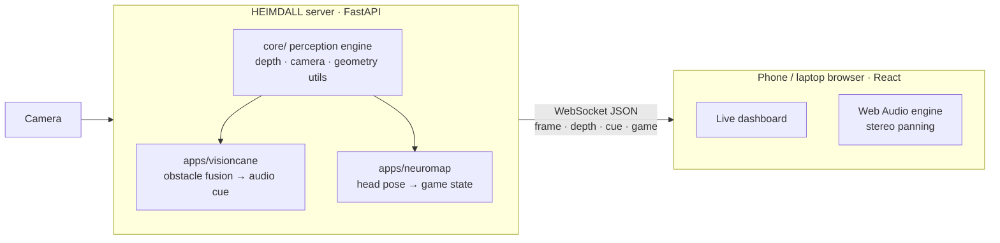

<div align="center">

# HEIMDALL

**Spatial perception from a single camera for assistive navigation and neuro-rehabilitation.**

*Student Innovation · Health Tech*

</div>

---

HEIMDALL turns an ordinary RGB camera into a spatial sensor. Its perception engine reconstructs dense depth from a single image stream, finds the obstacles and people in view, and tracks head pose in real time. It then turns all of that into **spatial audio** that anyone can hear through a phone browser.

There's no LiDAR, no stereo rig and no wearable sensor. Just one camera, a GPU and a pair of headphones.

## The problem

- **Navigating blind is hard.** A white cane only senses what it physically touches. It misses anything above waist height, like overhanging branches, open cabinet doors or signage, and it gives no warning until contact. Commercial electronic travel aids are expensive and rely on dedicated depth hardware.
- **Spatial neglect slows rehabilitation.** Many patients recovering from traumatic brain injury (TBI) or stroke lose awareness of one side of their space. Therapy is repetitive, needs a clinician present, and progress is hard to measure objectively between sessions.

Both problems come down to the same missing capability: **low-cost, real-time understanding of 3D space**, delivered through a sense the user can actually rely on.

## Applications

### VisionCane: a digital white cane

VisionCane continuously finds the **single most urgent obstacle** in front of the user and encodes it as sound:

| Cue | Meaning |
|---|---|
| **Stereo pan** (left ↔ right) | Bearing of the obstacle |
| **Beep rate** | Distance: faster means closer |
| **Loudness** | Proximity: louder means closer |
| **Silence** | Path is clear |

How the pipeline decides what matters:

1. **Metric depth estimation.** Every frame becomes a per-pixel map of real distances in metres, so alarm thresholds are actual distances rather than guesses relative to whatever happens to be in shot. The cane stays silent until something comes within **2.5 m**, and reaches maximum urgency at **0.6 m**.
2. **Ground-plane suppression.** The floor is always among the nearest surfaces in view, so it would otherwise trigger an alarm every single frame. HEIMDALL measures the floor from each frame — its distance recedes steadily up the image — and discounts it. Anything *standing* on the floor is nearer than the floor at that height in the image, so obstacles survive untouched. The suppression disables itself when the scene stops looking like a receding floor (a wall ahead, or an obstacle looming across the lower frame), so it can never silence a real hazard.
3. **Obstacle detection and fusion.** Detected objects are scored by how close they are (median distance inside the box), their size, detection confidence, and position in frame.
4. **Clinically sensible priors.** A *bottom-of-frame bias* boosts low obstacles near the user's feet (steps, tables, kerbs). A *border penalty* suppresses the false positives at frame edges that are common in monocular depth.
5. **Target locking with hysteresis.** Once an obstacle is selected, VisionCane stays locked on it across frames (IoU tracking with a short grace period). Acquiring a target is deliberately harder than keeping one, so an obstacle hovering at the alarm distance cannot flicker in and out of warning.
6. **Steady response.** Urgency rises quickly toward danger and falls back slowly, and a brief detection gap fades the cue instead of cutting to silence — so a single bad frame can never report a looming obstacle as distant.
7. **Depth-only fallback.** If no known object class is detected, VisionCane segments the nearest *depth blob* directly. Walls, poles and unrecognised clutter still trigger a warning.
8. **Angular mapping.** The obstacle's pixel position is converted into a true bearing angle using the camera's field of view, which drives the stereo pan.

### NeuroMap: spatial-attention rehabilitation

NeuroMap is a therapy game for retraining spatial awareness:

1. A tone plays from a specific direction (stereo pan plus a pitch unique to each zone).
2. The patient turns their head toward where the sound came from.
3. HEIMDALL tracks the patient's **head pose (yaw and pitch)** from the camera alone and checks whether they oriented to the correct zone within the response window.

**Adaptive difficulty.** The game starts with **3 zones** (left, centre, right). When the patient reaches ≥70 % accuracy over their last 10 rounds, it moves up to **5 zones** and then a **3 × 3 grid of 9 zones** that adds vertical orientation.

**Objective metrics.** Score, streak, per-session accuracy, level and live head-pose angles are streamed to the dashboard. That gives therapists measurable progress data instead of subjective notes.

Each zone's tone follows a musical scale (a major triad at level 1, for example), so the cues stay pleasant to hear across long sessions.

## Architecture



- **One shared cue schema.** Every app emits the same `{present, pan, interval, volume, pitch}` payload, so one browser audio engine serves them all.
- **Pure processors.** App logic in `apps/*/processor.py` is pure computation with no I/O, which makes each app easy to test and extend.
- **Runs locally, private by design.** All inference happens on the local machine. No video is uploaded, stored or sent to the cloud, which matters for patient data.
- **Any device as the client.** The UI is a web app, so a phone on the same Wi-Fi network becomes the audio device. Nothing needs installing.

## Tech stack

| Layer | Technology |
|---|---|
| Perception | Python, PyTorch (CUDA, FP16 inference), OpenCV, NumPy |
| Server | FastAPI, WebSockets, Uvicorn |
| Frontend | React 18, React Router, Vite |
| Audio | Web Audio API (oscillators, gain envelopes, stereo panning) |
| Tooling | uv (Python), npm (frontend) |

## Project structure

```
HEIMDALL/
├── core/                    # Shared perception engine
│   ├── depthmap.py          #   Depth estimation (FP16, GPU)
│   ├── camera.py            #   Camera capture wrapper
│   ├── video.py             #   Video-file source (for offline demos)
│   └── utils.py             #   Proximity maps, bbox geometry, border handling
├── apps/
│   ├── visioncane/          # Obstacle fusion → directional audio cues
│   │   ├── processor.py
│   │   └── config.py        #   All tuneable thresholds
│   └── neuromap/            # Head-pose tracking → rehab game loop
│       ├── processor.py
│       └── config.py        #   Timing, zones, level progression
├── server/
│   ├── main.py              # FastAPI app; serves the built frontend
│   ├── ws.py                # Streaming loops (depth apps + game apps)
│   └── routers/             # /visioncane and /neuromap endpoints
├── frontend/                # React dashboard
│   └── src/
│       ├── pages/           #   Home, VisionCane, NeuroMap
│       ├── components/      #   VideoFeed, DepthOverlay, AudioEngine, …
│       └── hooks/           #   useWebSocket, useAudioEngine
├── assets/                  # Model weights and audio assets
├── pyproject.toml           # Project metadata (uv)
├── uv.lock                  # Locked dependency versions
└── requirements.txt         # pip-compatible dependency list
```

## Getting started

### Prerequisites

- **NVIDIA GPU** with a recent driver (CUDA 12.8 wheels are used)
- **Python 3.9** and [**uv**](https://docs.astral.sh/uv/)
- **Node.js 18+**
- A webcam
- Headphones (stereo is required for directional cues)

### 1. Install

```bash
git clone https://github.com/Onecombatboot/SIH_2026.git
cd SIH_2026

# Python dependencies (recommended: uv)
uv sync
# …or with pip in a Python 3.9 virtual environment:
#   pip install -r requirements.txt

# Frontend
cd frontend
npm install
npm run build
cd ..
```

### 2. Run

Run from the **repository root** (asset paths are relative to it):

```bash
uv run python -m server.main
# or, with the pip virtual environment activated:
python -m server.main
```

Open **http://localhost:8000**, pick an app, and tap **Enable audio**.

> Model weights load on the first connection to each app, so the first launch takes a little longer. Leave the page open until the feed appears.

### 3. Use a phone as the audio device

1. Connect the phone to the same Wi-Fi network as the server.
2. Find the server's local IP (`ipconfig` on Windows, `ip a` on Linux).
3. Open `http://<server-ip>:8000` on the phone, plug in headphones, and tap **Enable audio**.

### Development mode

Hot-reloading frontend with the backend running separately:

```bash
uv run python -m server.main       # terminal 1 — backend on :8000
cd frontend && npm run dev         # terminal 2 — frontend on :5173 (proxies WebSockets to :8000)
```

## Configuration

Every tuneable parameter lives in a single config file per app.

**`apps/visioncane/config.py`**

| Setting | Default | Purpose |
|---|---|---|
| `DEFAULT_CAM_INDEX` | `0` | Camera device index |
| `FOV_DEG` | `68.0` | **Set this to your camera's horizontal field of view.** It maps pixels to bearings, so too wide a value collapses panning to hard left/right |
| `ALARM_DISTANCE_M` | `2.5` m | Start warning once an obstacle is nearer than this |
| `CRITICAL_DISTANCE_M` | `0.6` m | Distance at which urgency is maximum |
| `PROC_SHORT_SIDE` | `512` | Inference resolution; lower is faster |
| `MIN_INTERVAL` / `MAX_INTERVAL` | `0.07` / `0.30` s | Beep-rate range |
| `GROUND_TOLERANCE` | `0.30` | How much of the fitted floor counts as ground; raise if the floor triggers alarms |
| `METRIC_DEPTH` | `True` | Absolute distances. Set `False` for the scene-relative pipeline, which ranks what is nearest but knows no real distances |

**`apps/neuromap/config.py`**

| Setting | Default | Purpose |
|---|---|---|
| `CUE_DURATION` | `1.5` s | How long the directional tone plays |
| `RESPONSE_WINDOW` | `3.0` s | Time the patient has to orient |
| `UNLOCK_ACCURACY` | `0.70` | Accuracy needed to level up |
| `UNLOCK_ROUNDS` | `10` | Rounds evaluated for level-up |
| `ZONE_CONFIGS` | 3 / 5 / 9 zones | Zone boundaries, pans and pitches per level |

## WebSocket API

| Endpoint | Description |
|---|---|
| `GET /visioncane/config` | Active VisionCane configuration |
| `WS  /visioncane/ws` | Camera frame, depth map and obstacle cue stream |
| `GET /neuromap/config` | Active NeuroMap configuration |
| `WS  /neuromap/ws` | Annotated patient view, audio cue and game state stream |

Each message:

```jsonc
{
  "frame": "<base64 JPEG>",      // camera view
  "depth": "<base64 JPEG>",      // colour-mapped depth (VisionCane only)
  "cue": {
    "present":  true,            // false → stay silent
    "pan":      -0.42,           // -1 (left) … +1 (right)
    "interval": 0.12,            // seconds between beeps
    "volume":   0.73,            // 0 … 1
    "pitch":    1200.0           // Hz
  },
  "game": { ... }                // NeuroMap only: level, score, streak, accuracy, target zone, head pose
}
```

## Roadmap

- **Wearable form factor.** Chest- or glasses-mounted camera with an on-device edge GPU.
- **Haptic output channel.** Vibration cues for noisy environments or users with hearing loss.
- **Therapist portal.** Session history, progress charts and exportable reports for NeuroMap.
- **Hazard classes.** Dedicated warnings for stairs, drop-offs and moving vehicles.
- **Clinical validation.** Pilot studies with visually impaired users and rehabilitation centres.

## Team

<!-- Add team member names, roles and contacts here -->
